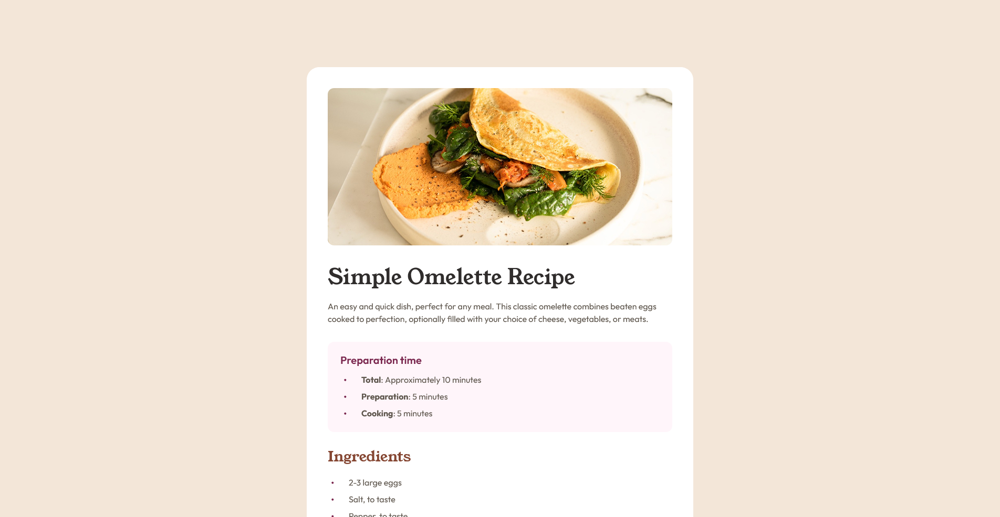

# Frontend Mentor - Recipe page solution

This is a solution to the [Recipe page challenge on Frontend Mentor](https://www.frontendmentor.io/challenges/recipe-page-KiTsR8QQKm). Frontend Mentor challenges help you improve your coding skills by building realistic projects.

## Table of contents

-   [Overview](#overview)
    -   [The challenge](#the-challenge)
    -   [Screenshot](#screenshot)
    -   [Links](#links)
-   [My process](#my-process)
    -   [Built with](#built-with)
    -   [What I learned](#what-i-learned)

## Overview

### Screenshot



### Links

-   Solution URL: [Github](https://gaetant15.github.io/FEM-newbie---recipe-page-main/)
-   Live Site URL: [Add live site URL here](https://your-live-site-url.com)

## My process

### Built with

-   Semantic HTML5 markup
-   CSS
-   Flexbox

### What I learned

I learned how to properly import custom fonts instead of using Google Fonts, and the best format to use in future projects, which is WOFF2.

I used 'font-display: swap' to provide a better UX by loading a default font while the page is loading and then loading the real font when it's ready."

```css
@font-face {
    font-family: 'Outfit';
    src: url('./assets/fonts/outfit/Outfit-VariableFont_wght.ttf') format('truetype-variations');
    font-weight: 400 700;
    font-style: normal;
    font-display: swap;
}
```
